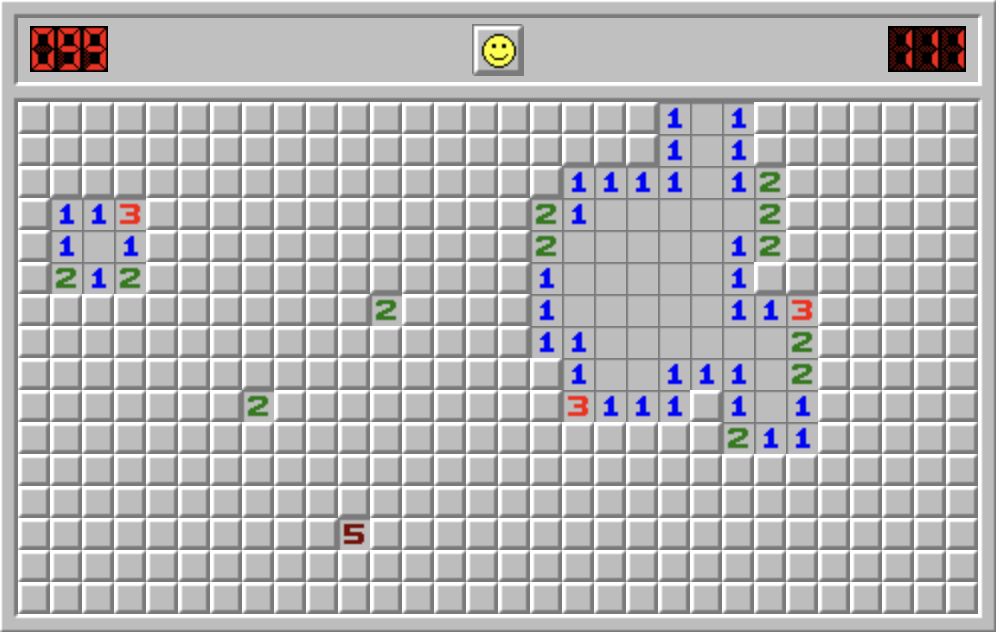

## Chartsweeper

This is a clone of the classic game Minesweeper. It's implemented using TypeScript and React, using state charts ([X State](https://github.com/statelyai/xstate)) to manage game state and transitions.

_TODO: Replace with actual gameplay_


## High Level Plan

### Responsibility Chain

**Game component**

- Configuration
- Time
- Flags
- Initializing game data
- Tracking win/lose state
- Rendering cells from game data

**Cell component**

- Managing and presenting cell data
- Handling direct cell interactions
- Dispatching searches to adjacent cells when necessary
- Reporting win/lose state to game component

**😎 Guy**

- Reacting to win/lose state, clicks
- Resetting games with current configuation

**Timer**

- Tracking time since first mine was traversed
- Resetting on game reset

**Flag counter**

- Tracking how many flags are placed
- Resetting on game reset

### Process

#### ✅ 1 Rough DOM layout

_edit: Ended up going a little overboard on style while stuck with some low-focus context-switching time_

- ~~Get all the elements in place with some basic styling~~
- ~~Create a dialog for game configuration and controls~~
- ~~Add some basic interactivity to the cells (click, right click, hover)~~

#### ✅ 2 Game generation

- ~~Get a naive board generating based on given dimensions~~
- ~~Add support to configure custom games~~
- ~~Tune the generation of the board to be correct, write a simple test to verify~~

Maybe Use a probability strategy to place mines as the grid is created. Track how many mines are placed to adjust probability accordingly. Should be able to get this working reliably if the probability is skewed higher towards the end (if necessary)

#### 3 Game interactions, states

- ~~Support game generation via custom dialog, reset~~
- Define init, ready, playing, win, lose states

#### 4 Cell interactions, states

**~~4.1 Start with basics, no traversal~~**

- ~~Hidden, revealed, and simulated adjacency data states~~
- Report win/lose state to game component
- Support adding flags
- Don't allow adding more flags than mines
- Don't allow revealing a flagged cell
- Don't allow traversal from a revealed cell

**4.2 Add traversal**

- Use something like a depth first search. Leverage cell state to avoid processing cells already visited
- Create some small fixtures to test against
- Perform traversal at the cell level (not grid or game). Use a map of cell coordinates to cell data to call neighbours

#### 5 Flag counter

- Ensure flags can't be added or removed without being tracked properly

#### 6 Timer

- Reset when game resets
- Stop when the game ends, or at 999

#### 7 Add 🙂 😮 😵 😎 states

Needs to be aware of when game is lost or won, and when the cursor clicked on a mine.

The state of the component could be represented by a single string passed in from the game, like:

```typescript
type GameState = 'ready' | 'clicking' | 'lost-game' | 'won-game'`
```

Then each state can be mapped to the UI accordingly

- ready -> 🙂
- clicking -> 😮
- lost-game -> 😵
- won-game -> 😎
- ~~Click to reset~~

#### Testing
